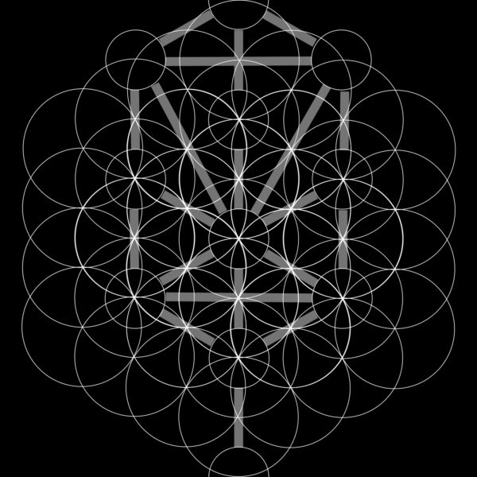

# arbr-reed-shorelines

Quantum computing has shown great promise in areas of chemistry, finding graphical ways to represent relationships from pieces of the whole of any new synthetic chemical conjuring. This project aims to combine this insight, zoomed out to the mythical level of individuals through the use of a tarot record keeping system for alchemical NFT morphology. 

The proposed application would be applied to the feed of an algorithm for NFT referrals where a meta-space can be traversed through remixing of some global repair function for perpetual storage of culture keeping & sortition in patchwork like local governments.

## geospatial
The alchemical tool aims to use both geospatial information relating stewards with tree totems in various areas for the whereabouts of where individuals auras (psyches) live in a biology connected region.

With the development of cyborg like citizens, characterized as humans that are sensorially connected in some way with read & write capabilities for cognition & body networks, following such [protocols](https://www.are.na/block/14409277). In the autonomous guiding systems of navigating and constructing patchwork like community cohesion, I believe these types of tools will be useful in fullfilling the meaning derivation function for NFT consumption.

The space of the landscape represents a type of labyrinth one can walk can explore around, selecting their NFTs and use the gained referral fees to go to planting actual trees. If connected with a bci, this data can also get used to reimburse fNIRS frequency data.

[navigation](https://stackoverflow.com/questions/60353088/three-js-orbitcontrols-rotating-around-a-ring)
[arena](https://codepen.io/Mamboleoo/pen/XzXazN)

## photonics

In a future driven by photonics, each card replicant can be a type of cultural operating system that runs from a far in some continous way, i.e. in magic noone wins. [photonics](https://kk.org/thetechnium/the-photonic-age/)

To give some examples, I've joked with my neighbour many of times how some situation represents some card, or, that 'someone is 8 of cups'ing you'. 

## oracular gates
The purpose of passing through users through such gates, is to create squad like entanglements. Why? To further guide such compression functions in the etheral as to relate our IRL being with dream state activations to unlock the realt metaverse.

- Layer 0 (9 parameters): Enneagram Personality Test (Self)
- Layer 1 (78 parameters): Tarot (Collective Psyche) [reed](https://github.com/moskalyk/reed-simulation)
- Layer 2 (64 parameters): I-Ching Transformation (Transitions)
- Layer 3 (10 parameters): Kabbalah Tree (Calendar & Sephiroth)

